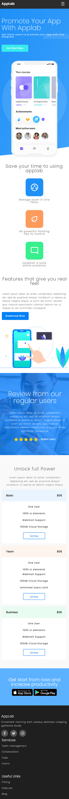

# RWD-Website-Project

This is a personal responsive website I built to sharpen my front-end skills and add a solid project to my portfolio. The focus was on creating a clean, user-friendly design with a mobile-first approach, so the site looks and feels great on any device.

## Key Features

- **Mobile-first responsiveness** — starts with a great experience on mobile, and scales smoothly up to tablets and desktops.
- **Pure CSS styling** — no fancy frameworks here! This project shows I really understand the basics of CSS and can write clean, efficient styles from scratch.
- **Modern layouts** — using flexbox and grid for a neat, organized look.
- **Consistent, pleasing design** — careful color choices and readable text for a visually appealing site.
- **Flexible base** — a solid foundation that's easy to build on, for example by adding JavaScript later.

## What I learned & why it matters

- Solid grasp of HTML and CSS, without relying on external tools.
- How to build a site mobile-first — focusing on smaller screens first, then enhancing for larger ones.
- The importance of good UX/UI — making sure the site is not just functional but enjoyable to use.
- Hands-on experience with project planning and problem solving.
- Using Git and GitHub to manage my code and track progress.

## Why you should consider me

I’m a self-driven learner, passionate about front-end development. Even though I’m new to commercial work, this project shows I’ve got the skills and mindset to create great websites. I’m ready to grow and take on challenges as a junior front-end developer.

